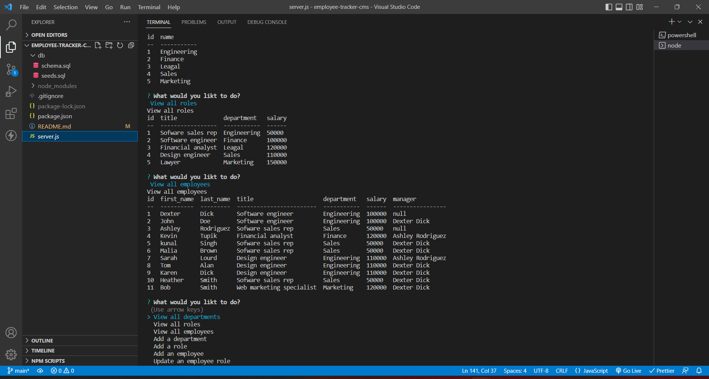

# Employee-tracker-cms

## Decription

The movtivation for this project was to develop a content management system to allow non-developers to easily view and interact with information stored in databases. This command-line application is built using Node.js Inquirer and MySQL.

## Walkthrough video

# Usage

1. npm i inquirer mysql console.table
2. run mysql -u root - p in the db folder
3. source schema.sql
4. In the root folder run node seeds/index.js to seed database
5. In the root folder run npm start to start Employee-tracker-cms.
